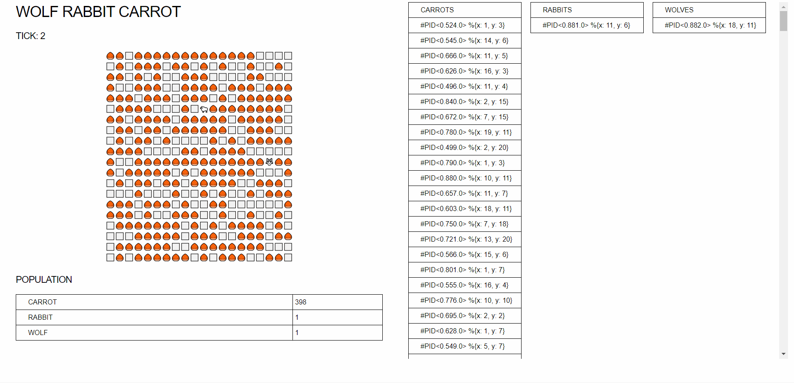

# Wolf Rabbit Carrot World

A simulated world inhabited by wolves, rabbits and carrots.

### Problem Statement:
1. Carrots grow in random patches
2. Rabbits roam around eating carrots, reproducing and running from wolves.
3. Wolves roam around eating rabbits, reproducing.
4. When a rabbit finds a carrot, nearby rabbits are messaged about the location. 
5. When a wolf finds a rabbit, nearby wolves are messaged about the location.

### Result

### To do

1. Better next step calculation
2. Wolf movement bugs